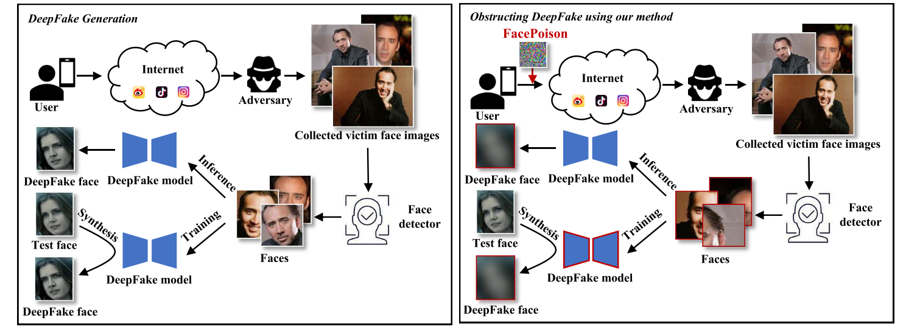

<h1 align="center">Hiding Faces in Plain Sight: Defending DeepFakes by Disrupting Face Detection</h1>

<div align='center'>
    <a href='https://hisssec.github.io/' target='_blank'><strong>Delong Zhu</strong></a><sup> 1</sup>&emsp;
    <a href='https://yuezunli.github.io/' target='_blank'><strong>Yuezun Li</strong></a><sup> 1*</sup>&emsp;
    <a target='_blank'><strong>Baoyuan Wu</strong></a><sup> 2</sup>&emsp;
    <a target='_blank'><strong>Jiaran Zhou</strong></a><sup> 1</sup>&emsp;

</div>

<div align='center'>
    <a target='_blank'><strong>Zhibo Wang</strong></a><sup> 3</sup>&emsp;
    <a target='_blank'><strong>Siwei Lyu</strong></a><sup> 4</sup>&emsp;
</div>

<div align='center'>
    <sup>1 </sup>Ocean University of China&emsp; <sup>2 </sup>The Chinese University of Hong Kong&emsp; <sup>3 </sup>Zhejiang University&emsp; <sup>4 </sup>University at Buffalo SUNY&emsp;
</div>
<div align='center'>
    <small><sup>*</sup> Corresponding author</small>
</div>
<br>

<div align="center">
  <!-- <a href='LICENSE'></a> -->
  <a href='https://arxiv.org/pdf/2412.01101'></a>
  <a href='https://img.shields.io/badge/Python-3.8.19-green'></a>
  <a href='https://img.shields.io/badge/PyTorch-2.2.1-green'></a>
  <!--<a href="https://github.com/KwaiVGI/LivePortrait"></a> -->
  <br>

</div>
<br>


<p align="center">
  🔥 Code has released.🔥
  
  <br>

</p>

## Introduction 📖
This repo, named **FacePoison**, contains the official PyTorch implementation of our paper [Hiding Faces in Plain Sight: Defending DeepFakes by Disrupting Face Detection](https://arxiv.org/pdf/2412.01101).
We are actively updating and improving this repository. If you find any bugs or have suggestions, welcome to raise issues or submit pull requests (PR). 💖

## Getting Started 🏁
### 1. Clone the code and prepare the environment 🛠️

> [!Note]
> We recommend using [Anaconda](https://www.anaconda.com/) to manage the Python environment:

```bash
git clone https://github.com/OUC-VAS/FacePoison
cd FacePoison

# create env using conda
conda create -n FacePoison python=3.8
conda activate FacePoison
pip3 install torch torchvision torchaudio
pip install -r requirements.txt
```

**Here**:  The version and device information I used is also provided below for reference.
```bash
- Python 3.8.19
- PyTorch 2.2.1
- CUDA 12.1
- GPU NVIDIA RTX 3060
- OS Ubuntu 22.04
```

### 2. Data Preparation 📦

You can download images and annotations of WIDER dataset from [Google Drive](https://drive.google.com/file/d/1wnuwBPZd0wfg8M1n1KupRnUxMiXlZ1rD/view?usp=drive_link) or [OneDrive](hhttps://stuouceducn-my.sharepoint.com/:u:/g/personal/zhudelong_stu_ouc_edu_cn/ESgiYGjMMGZBsNbWrgCfRWYBXxHybd2TvMdmQjj2dIlqpw). Unzip and place them in `./attack_public_datasets`.

If you intend to perform protection on videos, we provide the data for id0, id1, and id2 from the Celeb-DF used in our main experiments. You can download them from [Google Drive](https://drive.google.com/file/d/1jQQPtuTOF_6v1-97MIWTj_pnm8gVFgMo/view?usp=sharing) or [OneDrive](https://stuouceducn-my.sharepoint.com/:u:/g/personal/zhudelong_stu_ouc_edu_cn/EQcGToFTh6pAsO7SrBJk6G0Bm9hgg5nDlXqcEICfjZUuXw?e=YIHeHW) to assist with the next step of generating perturbations. Unzip and place them in `./VideoFacePoison/attack_public_datasets`.

### 3. Download Pretrained Weights 📥

Please download all pretrained weights of face detectors from [Google Drive](https://drive.google.com/file/d/1SDcrALa6Dp9OTCUNckToyr8BsncZktM6/view?usp=sharing) or [OneDrive](https://stuouceducn-my.sharepoint.com/:u:/g/personal/zhudelong_stu_ouc_edu_cn/EZzuihap0hhFi-DeLaogK3YBoux9cORzaKuHkZEeKJUfbg?e=nfEOF3). Place them in `./detectors/xxx/weights`, respectively.

### 4. FacePoison 🎭
> [!IMPORTANT]
> When you need to attack **YOLO5Face**, you need to uncomment lines 24 and 25 in the code `./detectors/yolov5face/__init__.py`, and conversely, comment out the code during inference.

#### Attack 💉

```bash
cd attack_public_datasets
python run_poison.py
```
If the script runs successfully, you will get a series of adversarial samples in `/save_data/wider/adv/`.
#### Inference 🔎
```bash
python origin_detect.py  # Clean_sample
python adv_detect.py  # Adversarial_sample
```

### 5. VideoFacePoison 👾

#### Attack 💉

FacePoison is applied to every frame of the videos：
```bash
# FP-all
cd VideoFacePosion
python run_poison.py
```
#### Inference 🔎

> [!Note]
> - Since the Celeb-DF videos do not have face annotations, we use the detection results from PyramidBox — the best-performing face detector on the WIDER dataset — as the ground truth for the other four detectors. To detect faces for PyramidBox itself, we use the results from the second-best detector: DSFD.
> - For the generation of VideoFacePoison, we significantly reduced the time cost. In the code, after generating the perturbations, we directly use them for testing.
> - Before executing VideoFacePoison, make sure that FacePoison has been applied to all frames.

```bash
python origin_detect.py   # Clean_sample
python adv_detect.py --exp 'exp3' # Adversarial_sample
```
The `--exp` argument supports four options: [origin, exp1, exp2, exp3], which correspond to the methods [FP-all, FP-fixed, FP-forward, VideoFacePoison] in the paper.

## Acknowledgements 💐
We would like to thank the contributors of [RetinaFace](https://github.com/biubug6/Pytorch_Retinaface), [YOLO5Face](https://github.com/deepcam-cn/yolov5-face), [PyramidBox](https://github.com/cs-giung/face-detection-pytorch), [S3FD](https://github.com/cs-giung/face-detection-pytorch) and [DSFD](https://github.com/cs-giung/face-detection-pytorch) repositories, for their open research and contributions.

## Citation 💖
If you find FacePoison useful for your research, welcome to 🌟 this repo and cite our work using the following BibTeX:
```bibtex
@article{zhu2024hiding,
  title={Hiding Faces in Plain Sight: Defending DeepFakes by Disrupting Face Detection},
  author={Zhu, Delong and Li, Yuezun and Wu, Baoyuan and Zhou, Jiaran and Wang, Zhibo and Lyu, Siwei},
  journal={arXiv preprint arXiv:2412.01101},
  year={2024}
}

@inproceedings{li2023face,
  title={Face Poison: Obstructing DeepFakes by Disrupting Face Detection},
  author={Li, Yuezun and Zhou, Jiaran and Lyu, Siwei},
  booktitle={IEEE International Conference on Multimedia and Expo},
  year={2023}
}
```
## Contact 📧
[**Delong Zhu**](https://hisssec.github.io/); **zhudelong@stu.ouc.edu.cn**

